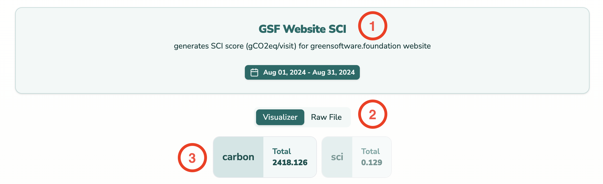
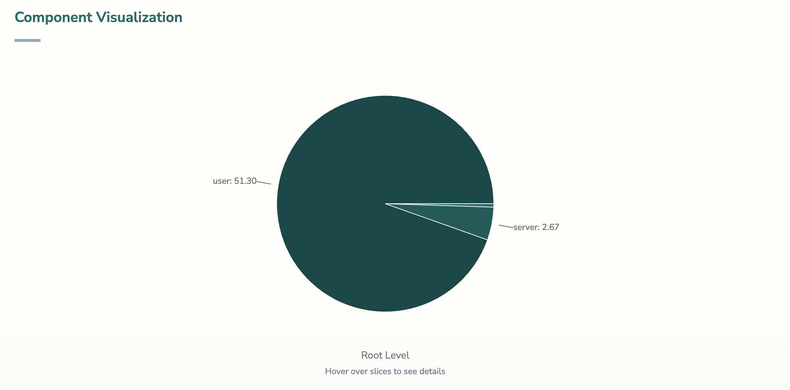
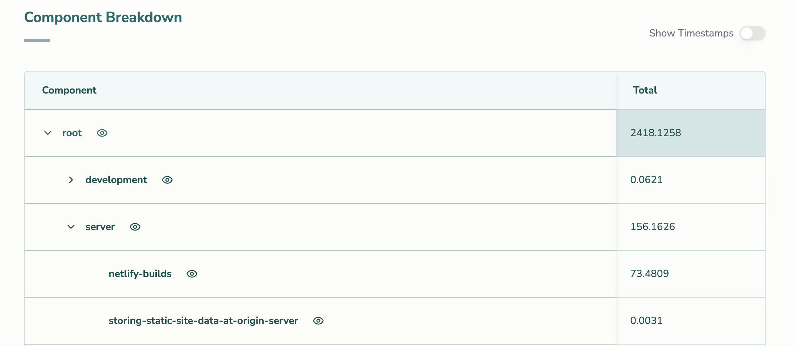
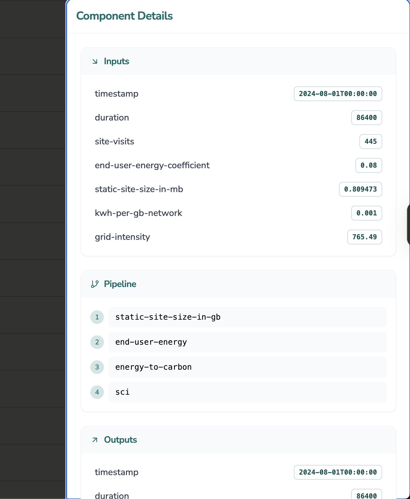

# Quickstart

Impact Framework is an open-source tool for measuring the environmental impacts of software applications. At its core, it processes Impact Manifest Protocol (IMP) files, YAML files that describe your system’s architecture, the operations to execute, and the observational data to process. In this chapter, you’ll learn how to work with the framework hands‑on and gain a conceptual understanding of its components.

The quickstart helps you get hands‑on immediately and reinforces that an IMP file is both executable and auditable. You can always trace your computed outputs to the exact configuration and input data.

> [!TIP]
> You will often encounter the terms **manifest files** and **IMP files** used interchangeably; they refer to the same concept.

## Install Impact Framework

Before you begin, ensure that you have Nodejs installed on your machine. Then install Impact Framework globally with the following command:

```bash
npm install -g @grnsft/if
```

To verify that the installation was successful, run:

```bash
if-run --help
```

You should see a help screen similar to this:

```bash
Impact Framework

  Helpful keywords: 

Options

  -m, --manifest string [path to the input file]
  -o, --output string [path to the output file]
  -n, --no-output [prevent output to the console]
  -h, --help [prints out the above help instruction]
  -a, --append [append to outputs, instead of overwriting]
  -d, --debug [prints out debug logs to the console]
  --observe [executes only observe pipeline of the manifest]
  --regroup [executes only regroup pipeline of the manifest]
  --compute [executes only compute pipeline of the manifest]
  
Green Software Foundation
  Graduated Project
  ...
```


> [!NOTE]
> This CLI interface is the gateway to running your IMP files. The `if-run` command takes your manifest file, processes it according to the configuration in its context, and outputs enriched data that can be used for further analysis or visualization.

## Setup your workspace

Organize your work by creating a new folder on your machine.

1. On your computer, create a folder called `my-first-imp`
2. Download [this sample manifest file](https://raw.githubusercontent.com/Green-Software-Foundation/if-course/refs/heads/main/src/quickstart-imp.yaml), which contains everything needed to compute the environmental impacts of a website (the GSF website), and save it as `quickstart-imp.yaml` inside `my-first-imp`

## Run Impact Framework

Open your terminal in `my-first-imp` and execute:

```bash
if-run --manifest quickstart-imp.yaml
```

Congratulations, you've computed the environmental impacts of the Green Software Foundation website. It's hard to parse the output to glean useful data, such as how much actual carbon we emitted, so first let's output to a file and then use our visualizer to view the results.

Let's re-run the command but output to a file instead of the console.

```bash
if-run --manifest quickstart-imp.yaml --output quickstart-output.yaml
```

> [!TIP]
> To save a few characters, you can type `if-run -m quickstart-imp.yaml -o quickstart-output.yaml`

Now, if you open up the file `quickstart-output.yaml` and go to the end of the file, you will see a value for carbon and software carbon intensity (SCI) that is the same as below.

```yaml
  outputs:
    - carbon: 0.11898977999999999
      sci: 0.11898977999999999
      timestamp: '2025-10-27T00:00:00.000Z'
      duration: 2
    - carbon: 0.11898977999999999
      sci: 0.11898977999999999
      timestamp: '2025-10-27T00:00:02.000Z'
      duration: 2
    - carbon: 0.11898977999999999
      sci: 0.11898977999999999
      timestamp: '2025-10-27T00:00:04.000Z'
      duration: 2
    - carbon: 0.11898977999999999
      sci: 0.11898977999999999
      timestamp: '2025-10-27T00:00:06.000Z'
      duration: 2
    - carbon: 0.11898977999999999
      sci: 0.11898977999999999
      timestamp: '2025-10-27T00:00:08.000Z'
      duration: 2
  aggregated:
    # highlight-next-line
    carbon: 0.5949488999999999
    # highlight-next-line
    sci: 0.11898977999999998
# end
```

This is the carbon emissions of the Green Software Foundation's website for a brief window of time. But this is hard to parse, so let's load up the file in our visualizer.

## View in the Visualizer

The visualizer is a web application that parses the contents of an IMP file and presents the data in a much more user-friendly manner. The visualizer is hosted at `https://viz.if.greensoftware.foundation`.

To use the visualizer, you need to make your output file accessible via a URL. There are several ways to do this:

### Option 1: Using `if-viz` (Recommended)

The `if-viz` CLI tool serves your output file locally and opens the visualizer in your browser automatically.

Make sure you are in the folder where `quickstart-output.yaml` lives, and type:

```bash
if-viz --manifest quickstart-output.yaml
```

This will:

1. Serve the file `quickstart-output.yaml` from your local computer so it can be accessed as `localhost:8080/quickstart-output.yaml`
2. Open your default browser pointed to `https://viz.if.greensoftware.foundation` and load the file
3. Automatically refresh the browser any time you update `quickstart-output.yaml`

### Option 2: Using a Simple HTTP Server

If you don't have `if-viz`, you can serve the file yourself. Navigate to the folder where `quickstart-output.yaml` lives and start a simple HTTP server:

```bash
# Using Python 3
python3 -m http.server 8080

# Or using Node.js (if you have npx)
npx serve -p 8080
```

This will serve your file at `http://localhost:8080/quickstart-output.yaml`. Then:

1. Open your browser and navigate to: `https://viz.if.greensoftware.foundation`
2. In the visualizer, enter the URL: `http://localhost:8080/quickstart-output.yaml`
3. The visualizer will load and display your IMP file

> [!TIP]
> Keep the server running while you work with the visualizer. If you re-run your manifest and update the output file, simply refresh the visualizer page to see the latest results.

### Option 3: Using a Public URL

Alternatively, you can host your output file on a public service like GitHub (easier, but relies on third party service):

1. Upload `quickstart-output.yaml` to a GitHub repository
2. Get the raw file URL (e.g., `https://raw.githubusercontent.com/yourusername/yourrepo/main/quickstart-output.yaml`)
3. Navigate to `https://viz.if.greensoftware.foundation`
4. Enter your GitHub raw URL

We will dive into the visualizer in more detail later, but for now, there are a few key places for you to see.

### Overview



1. This is your manifest file's title, description and time range.
2. These buttons let you switch between seeing the visualizer or the raw manifest file.
3. These are this manifest's carbon emissions and the SCI score. **These are buttons**; if you select carbon, the rest of the visualizer will switch to displaying the breakdown of carbon; if SCI, it will display the breakdown of the SCI score.

> [!TIP]
> **Carbon** and **SCI** are the aggregated values. Whatever values you configure to aggregate in a manifest file will be presented in the visualizer at the top. You can find more information about aggregation in the course's aggregate section.

### Component Visualization

Underneath, you will find the component pie chart. This pie chart shows how the different components of the computation contribute to the total (either carbon or sci in this example).



> [!TIP]
> The computation of an impact in IF is done through a tree structure. The total carbon computed is the sum of the carbon for a series of components grouped into nodes. The tree's root node contains the total carbon emissions, but the tree is a tree of emissions; you can click into each node and see how sub-components contributed to the total emissions.

### Component Breakdown

Underneath the pie chart is the table. This is a tabular representation of the tree in the IMP file. Each row in the table is a node in the tree. The child nodes (components) are the rows which have no children, these are the sources of impacts. The rows with children are just the aggregate values of the components.



> [!TIP]
> A **component** is something that has impacts; it can be a CPU, a server, a user, or anything you want. Conceptually, a component is just something that has an impact. In terms of the tree, a component is only in the tree's leaves.
> 
> A **grouping** is a set of components or other groupings; they form higher-level nodes in the tree and are helpful ways to group components and their impacts together; for instance, you might create a tree where each component is a server, and the servers are grouped into "regions". The region for west-uk is considered a grouping. 
> 
> In the table, rows with children are grouping nodes and rows without children are component nodes in the tree.

### Component FlyOut

When you click on a component (either in the table or in the pie chart), a fly-out side panel will appear like so:



The side panel shows the data and methodology used to calculate the impact, in this case, carbon.

Our fly-out has only three sections; however, they can contain four like so:

- **defaults**: These are default values which are repeated across all observations (useful if you have multiple observations)
- **inputs**: These are the input observations, the data you are feeding into the calculation of the impacts.
- **pipeline**: This represents the methodology used to compute the impacts; you can dive into the details in the IMP file.
- **outputs**: These are the output impacts, the result of passing the inputs into the pipeline; carbon, as you can see, is an output in this case.

We will explore these concepts in the next module.

## Change Assumptions

One of the most potent aspects of IF and IMP files is that they are **executable**. 

They contain not just the output aggregated impacts but also all the inputs, observations, data, and methodologies required to **recompute** the impacts with different data and methodologies.

Here, we will change a key assumption in our manifest file and recompute the impact.

The **grid intensity** is a measure of how clean or dirty the electricity that the application consumes is. It's a number which means grams of carbon emitted per kWh. In this manifest file, we used a value of 494 (the global average). You might believe this to be incorrect, or you might want to imagine how your emissions might be if you run your website in an area with more dirty electricity. With IMPs, you can edit the value and re-run the manifest to explore these scenarios.

Open up the `quickstart-imp.yaml` in your favourite code editor and find the node `tree.children.greensoftware-foundation-website.defaults.grid/carbon-intensity`, so under `tree` find `children`, then `greensoftware-foundation-website`, then `defaults` and under there, you will see a parameter called `grid/carbon-intensity` like so:


```yaml
tree:
  children:
    greensoftware-foundation-website:
      pipeline:
        compute:
          - datacenter-energy
          - network-energy
          - device-energy
          - sum-energy
          - datacenter-operational-carbon
          - network-operational-carbon
          - device-operational-carbon
          - sum-operational-carbon
          - datacenter-embodied-carbon
          - network-embodied-carbon
          - device-embodied-carbon
          - sum-embodied-carbon
          - sum-carbon
          - sci
      defaults:
        # Data transfer per page view
        # Source: Direct observation + estimation (CSS: 200KB, JS: 100KB, Fonts: 200KB, Images: 500KB, HTML: 50KB)
        # Total: 1,050 KB = 1.05 MB = 0.00105 GB
        data-transfer-gb: 0.00105
        # Energy intensity coefficients (kWh/GB)
        # Source: Sustainable Web Design Model v4, 2024
        # https://sustainablewebdesign.org/estimating-digital-emissions/
        datacenter-energy-intensity: 0.055  # kWh/GB for datacenter
        network-energy-intensity: 0.059     # kWh/GB for network
        device-energy-intensity: 0.080      # kWh/GB for end-user device
        # Grid carbon intensity (gCO2e/kWh)
        # Source: Sustainable Web Design Model v4, 2024 - Global average
        # https://sustainablewebdesign.org/estimating-digital-emissions/
        # highlight-next-line
        grid/carbon-intensity: 494
```

Change `grid/carbon-intensity` to `1000`; it should now look like this:

```yaml
        # highlight-next-line
        grid/carbon-intensity: 1000
```

Now you can re-run the manifest file like before

```bash
if-run --manifest quickstart-imp.yaml --output quickstart-output.yaml
```

The visualizer should update automatically if you are serving the file locally; if not, refresh the browser.

The aggregated carbon figure is now `1.2043` instead of `0.5949`. By roughly doubling the grid intensity, we've roughly doubled the carbon emissions — which makes intuitive sense.

> [!IMPORTANT]
> With IF, you are not just computing the emissions of your software; you are creating a **model** which computes the emissions of your software. Since it's a model, you can do very useful things, such as change the model, explore different methodologies, choose different coefficients, and see the impacts of those choices. 
> 
> Measurement **always** requires making many assumptions, so don't fall into the trap of believing there is one true value for everything. Every time we measure, we make assumptions and trade-offs. With Impact Framework, those assumptions are in the manifest, so when you share your final figure, you also share your model, methodology, inputs, and thinking.
> 
> The only path forward in this space is one where we are open and transparent about our measurements. Where we stop unquestioningly trusting what we are told and start verifying. A future where instead of calling someone out for a mistake, we correct it for them and say thanks.

The rest of this course will teach you how to compute the emissions of a simple application by creating your manifest file from scratch. We will teach you the format and structure of a manifest file and how to plan an investigation, think critically about your approach, and handle common problems such as a lack of data and models.
